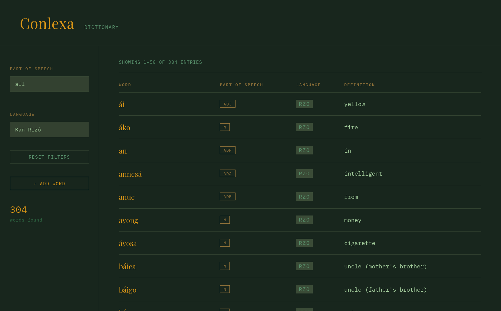
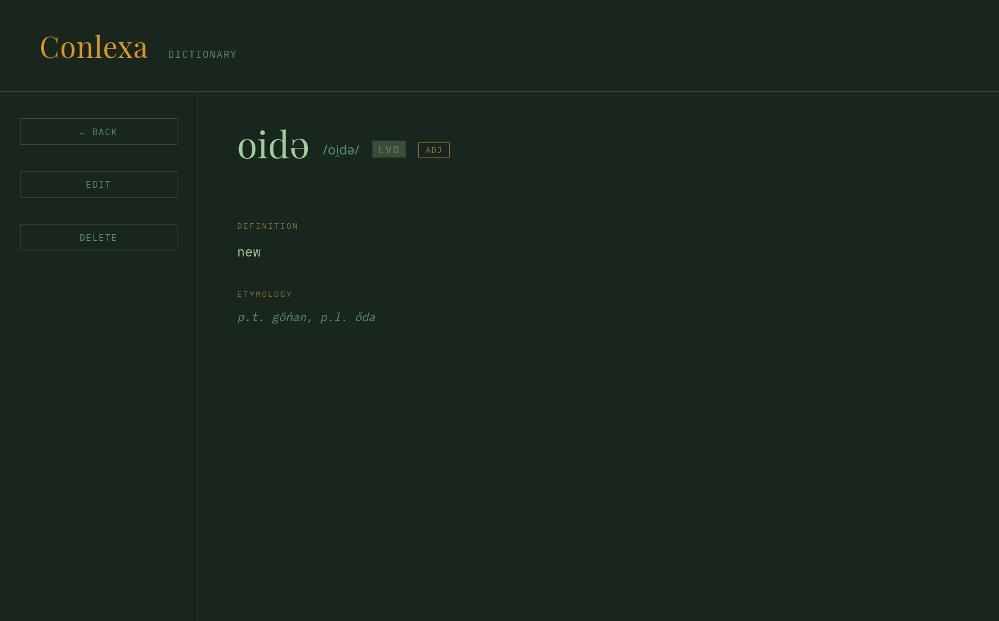
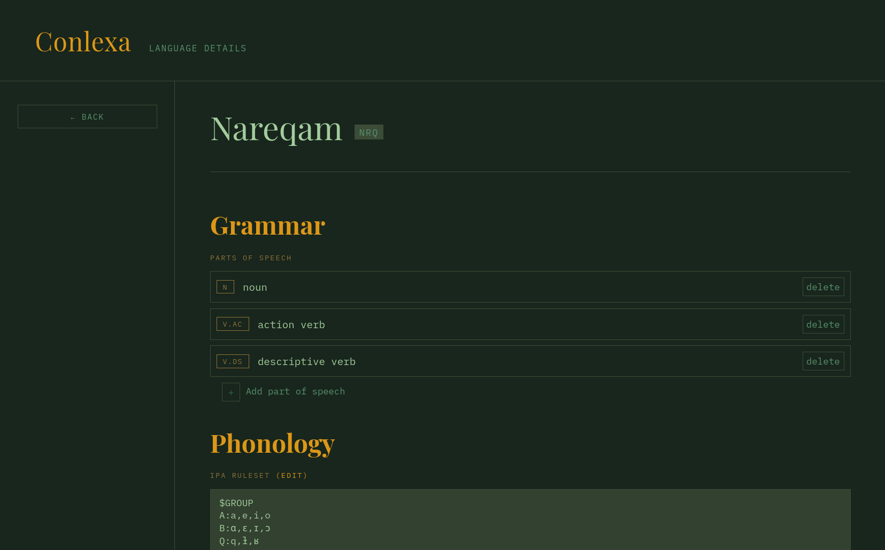

# Conlexa - Self-hosted conlanging tool

## Screenshots






## Todo

- [ ] Dictionary
  - [x] Add word
  - [x] View and filter words
  - [x] Search words
  - [x] Edit words
  - [x] Delete words
  - [ ] Constructed script support
    - [x] Support romanized vs scripted word entry
    - [ ] Display constructed script with option in settings
- [ ] Notebook (grammar, translations)
- [ ] Languages
  - [ ] Add language and code
  - [ ] Language presentation and page
    - [ ] Flag
    - [ ] Description
    - [x] Parts of speech
- [x] IPA auto-guesser
  - [ ] multiple rulesets for multiple dialects
  - [ ] Add wordshift playground for testing
- [ ] Conjugator
- [ ] Theming straight from the interface


## How to

### Database

Database was made in PostgreSQL. There is an example sql script for creating the tables in this repo. You should then insert your language name and codes (example in the script) and you can start adding words through the interface. Alternatively, you should be able to import CWS-generated csv files from your db management program into table `words`.

Requirements:

```
pip install fastapi uvicorn psycopg2-binary
```

Change environment variables to your username and password in `run.sh` then run it. Open `localhost:8000` in your browser.


For now it works on Linux.

## Docker Deployment

You can run Conlexa using Docker Compose for easy setup.

### Prerequisites
- Docker and Docker Compose installed

### Quick Start

1. Clone the repository and navigate to the project directory
2. Run the following command:

```bash
./docker-start.sh
```

Alternatively, use:
```bash
docker-compose up --build
```

This will:
- Start a PostgreSQL 15 database container
- Initialize the database with the required tables
- Build and start the FastAPI application
- The application will be available at http://localhost:8000

### Configuration

Environment variables can be modified in the `docker-compose.yml` file or by creating a `.env` file in the project root.

### Building Only

To build the Docker image without starting:
```bash
./docker-build.sh
```

### Running Without Docker Compose

If you have an existing PostgreSQL database, you can build and run just the application container:

```bash
docker build -t conlexa .
docker run -p 8000:8000 \
  -e DB_HOST=your_db_host \
  -e DB_PORT=5432 \
  -e DB_NAME=conlang \
  -e DB_USER=conlexa \
  -e DB_PASSWORD=your_password \
  conlexa
```

### Notes
- Database data is persisted in a Docker volume named `postgres_data`
- The `site` directory is mounted as a volume for easy frontend updates
- Logs are written to `logs.txt` in the project directory
